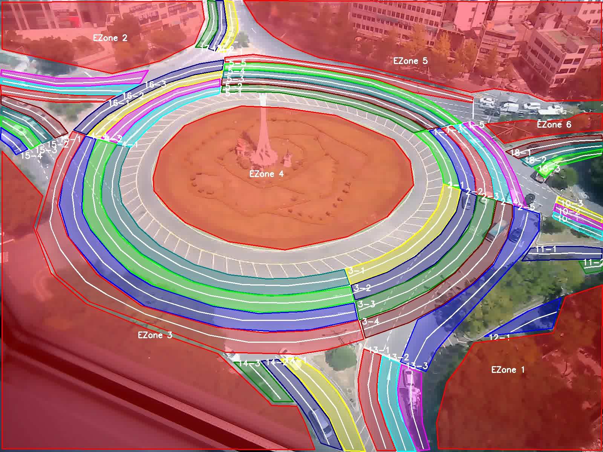

# Vehicle Driving Behavior Analysis Dataset

This repository contains a comprehensive dataset and processing pipeline for analyzing vehicle driving behaviors from video data. The dataset includes lane annotations, vehicle detection results, and driving behavior classifications for research purposes.

## Dataset Overview

The dataset consists of processed video data with vehicle trajectories, lane information, and driving behavior classifications. It is designed for training and evaluating graph neural networks for driving behavior prediction.

## Visual Examples

### Visual Examples

| Lane Annotations | Vehicle Behavior Visualization |
|-----------------|-------------------------------|
|  | <a href="https://www.youtube.com/watch?v=ZOX_vPBZQx4"></a> |
|*Interactive lane annotation tool showing road lanes, centerlines, and exclusion zones*|*Annotated video showing vehicle trajectories, behavior classifications, and lane information*|
### Processing Pipeline Overview
```
Input Video → Vehicle Detection → Lane Assignment → Behavior Classification → Graph Data
```

## Folder Structure

```
tii_graph_data/
├── 1_road_roi.py                           # Lane annotation tool
├── 2_exclude_bbox_first.py                 # Vehicle filtering and lane assignment
├── 3_driving_behavior_classification.py    # Driving behavior classification
├── 4_visualization_filtered.py             # Visualization tool
├── 5_convert_relative_image_graphdata.py   # Graph data conversion (image coordinates)
├── 6_convert_relative_world_graphdata.py   # Graph data conversion (world coordinates)
├── road_input.jpg                          # Input road image
├── lane_annotations.json                   # Lane annotation data
├── video_data/                             # Original video files
│   └── received_file_20240822_101524.avi
├── json_data/                              # Raw vehicle detection data
│   └── received_file_20240822_101524.json
│   └── ...
├── 1_filtered_vehicle_data/                # Filtered vehicle data
│   └── received_file_20240822_101524.json
│   └── ...
├── 2_categorized_vehicle_data/             # Behavior classified data
│   └── received_file_20240822_101524.json
│   └── ...
├── 3_visualization_filtered_result/        # Visualization outputs
│   └── received_file_20240822_101524_visualization.mp4
├── 4_graph_data/                           # Graph neural network data (image coordinates)
│   ├── combined_vehicle_data_*.pkl         # PyTorch Geometric data files
│   └── data_statistics.txt                 # Dataset statistics
└── 5_world_graph_data/                     # Graph neural network data (world coordinates)
    ├── combined_vehicle_data_*.pkl         # PyTorch Geometric data files
    └── data_statistics.txt                 # Dataset statistics
```

## File Descriptions

### 1. Lane Annotation Tool (`1_road_roi.py`)
**Purpose**: Interactive tool for annotating road lanes and exclusion zones
**Input**: Road image (`road_input.jpg`)
**Output**: `lane_annotations.json`
**Usage**:
```bash
uv run python 1_road_roi.py --image ./road_input.jpg --json ./lane_annotations.json
```

**User Modifications**:
- Adjust `--display-width` and `--display-height` for different screen resolutions
- Modify lane colors in `get_color()` function
- Add custom exclusion zones using 't' key

### 2. Vehicle Filtering (`2_exclude_bbox_first.py`)
**Purpose**: Filters vehicles based on exclusion zones and assigns lane IDs
**Input**: Raw vehicle detection JSON, lane annotations
**Output**: Filtered vehicle data in `1_filtered_vehicle_data/`
**Usage**:
```bash
uv run python 2_exclude_bbox_first.py --video ./video_data/video.avi --json ./json_data/data.json
```

### 3. Behavior Classification (`3_driving_behavior_classification.py`)
**Purpose**: Classifies driving behaviors (stop, lane_change, normal_driving)
**Input**: Filtered vehicle data
**Output**: Behavior classified data in `2_categorized_vehicle_data/`
**Usage**:
```bash
uv run python 3_driving_behavior_classification.py --json ./1_filtered_vehicle_data/data.json
```

**User Modifications**:
- Adjust `--min-speed` threshold for stop detection (default: 2.5 km/h)
- Modify `--sequence-length` for lane change detection (default: 7 frames)
- Add new behavior categories in `classify_driving_behavior()`

### 4. Visualization (`4_visualization_filtered.py`)
**Purpose**: Creates annotated video with vehicle trajectories and behaviors
**Input**: Behavior classified data, original video
**Output**: Visualization video in `3_visualization_filtered_result/`
**Usage**:
```bash
uv run python 4_visualization_filtered.py --video ./video_data/video.avi --json ./2_categorized_vehicle_data/data.json
```

### 5. Graph Data Conversion - Image Coordinates (`5_convert_relative_image_graphdata.py`)
**Purpose**: Converts vehicle data to graph format using image coordinates
**Input**: Behavior classified data
**Output**: PyTorch Geometric data files in `4_graph_data/`
**Usage**:
```bash
uv run python 5_convert_relative_image_graphdata.py
```

### 6. Graph Data Conversion - World Coordinates (`5_convert_relative_world_graphdata.py`)
**Purpose**: Converts vehicle data to graph format using world coordinates
**Input**: Behavior classified data with world coordinates
**Output**: PyTorch Geometric data files in `4_world_graph_data/`
**Usage**:
```bash
uv run python 6_convert_relative_world_graphdata.py
```

## Installation and Setup

### Prerequisites
- Python 3.8+
- CUDA 11.8 (for GPU acceleration)
- uv package manager

### Environment Setup
```bash
# Install uv if not already installed
pip install uv

# Install dependencies
uv sync

# Verify installation
uv run python -c "import torch; print(f'PyTorch version: {torch.__version__}')"
```

### Dependencies
- **PyTorch**: 2.0.0+cu118 (CUDA 11.8 support)
- **PyTorch Geometric**: 2.6.1
- **OpenCV**: 4.10.0.84
- **NumPy**: 1.23.0
- **Pandas**: 2.0.3
- **Matplotlib**: 3.7.5
- **SciPy**: 1.10.1
- **tqdm**: 4.66.5
- **psutil**: 5.9.1

## Processing Pipeline

### Step 1: Lane Annotation
```bash
uv run python 1_road_roi.py
```
- Load road image and annotate lanes
- Define exclusion zones
- Save annotations to JSON

### Step 2: Vehicle Filtering
```bash
uv run python 2_exclude_bbox_first.py
```
- Filter vehicles outside exclusion zones
- Assign lane IDs to vehicles
- Track vehicle persistence

### Step 3: Behavior Classification
```bash
uv run python 3_driving_behavior_classification.py
```
- Classify driving behaviors
- Calculate speed and acceleration
- Generate behavior statistics

### Step 4: Visualization
```bash
uv run python 4_visualization_filtered.py
```
- Create annotated video
- Display vehicle trajectories
- Show behavior classifications

### Step 5: Graph Data Generation
```bash
# For image coordinates
uv run python 5_convert_relative_image_graphdata.py

# For world coordinates
uv run python 5_convert_relative_world_graphdata.py
```
- Convert to PyTorch Geometric format
- Generate node and edge features
- Create multiple graph configurations

## Data Structure

### Raw Vehicle Detection Data (json_data/)
Raw vehicle detection results from video processing:

```json
{
  "object_id": 11,
  "bbox": [878, 211, 39, 15],
  "position": [75.1442261, 4.8946166, -55.26317],
  "class": 0,
  "speed": 44.71412015639241,
  "direction": [12.395780499999987, 0, 0.7846370000000036],
  "acceleration": 62.102944661656124,
  "frame": 2,
  "category": "",
  "neighbors_ids": [9, 82, 8, 95, 31, 108, 62],
  "neighbors_distances": [9.51797110122735, 17.42144386082408, ...],
  "neighbors_speeds": [31.162106502292207, 11.221498435015738, ...],
  "neighbors_directions": [[8.630099999999956, 0, 0.6709290000000223], ...],
  "neighbors_accelerations": [43.280703475405836, 15.585414493077414, ...],
  "neighbors_world_positions": [[84.10864, 4.8946166, -52.0645676], ...],
  "neighbors_bbox": [[801, 212, 42, 19], ...]
}
```

**Key Fields:**
- `object_id`: Unique vehicle identifier
- `bbox`: Bounding box [x, y, width, height] in image coordinates
- `position`: 3D world coordinates [x, y, z]
- `speed`: Vehicle speed in km/h
- `direction`: Movement direction vector
- `acceleration`: Vehicle acceleration
- `frame`: Video frame number
- `neighbors_*`: Information about nearby vehicles

### Processed Behavior Data (2_categorized_vehicle_data/)
Enhanced data with behavior classifications and lane assignments:

```json
{
  "object_id": 103,
  "bbox": [588, 10, 17, 19],
  "position": [127.450912, 4.8946166, -95.86969],
  "class": 0,
  "speed": 0,
  "direction": [0, 0, 0],
  "acceleration": 3.659789832320519,
  "frame": 70,
  "category": "stop",
  "neighbors_ids": [234, 35, 70, 77, 234, 21, 35],
  "neighbors_distances": [3.2357413573003653, 9.074350923291927, ...],
  "neighbors_speeds": [0, 0, 5.838702133981688, ...],
  "neighbors_directions": [[0, 0, 0], [0, 0, 0], ...],
  "neighbors_accelerations": [0, 0, 0.13912568283737606, ...],
  "neighbors_world_positions": [[124.4507, 4.8946166, -97.08161], ...],
  "neighbors_bbox": [[610, 9, 17, 16], ...],
  "lane_id": "17-2"
}
```

**Additional Fields:**
- `category`: Behavior classification ("stop", "lane_change", "normal_driving")
- `lane_id`: Assigned lane identifier

## Dataset Statistics

The dataset includes:
- **Vehicle trajectories**: Position, speed, acceleration data
- **Lane information**: Lane boundaries and centerlines
- **Behavior labels**: stop, lane_change, normal_driving
- **Graph features**: Node features (9D), Edge features (5-10D)
- **Multiple configurations**: 4-7 neighbors, 5-10 edge dimensions

## Output Files

### Graph Data Files
- `combined_vehicle_data_{neighbors}_{edges}.pkl`: PyTorch Geometric Data objects
- `data_statistics.txt`: Dataset statistics and class distribution

### Visualization Files
- `*_visualization.mp4`: Annotated videos with vehicle trajectories
- `lane_annotations_result.jpg`: Lane annotation visualization

## Customization Guide

### Adding New Behaviors
1. Modify `classify_driving_behavior()` in `3_driving_behavior_classification.py`
2. Update `CATEGORY_COLORS` in `4_visualization_filtered.py`
3. Adjust label mapping in graph conversion scripts

### Modifying Graph Features
1. Edit `extract_node_features()` for node feature changes
2. Modify `extract_edge_attr()` for edge feature changes
3. Update feature dimensions in graph conversion scripts

### Changing Coordinate Systems
- Use `5_convert_relative_image_graphdata.py` for image coordinates
- Use `5_convert_relative_world_graphdata.py` for world coordinates
- Modify coordinate transformation functions as needed

## Citation

If you use this dataset in your research, please cite:
```
@dataset{vehicle_driving_behavior_2025,
  title={Vehicle Driving Behavior Analysis Dataset},
  author={Your Name},
  year={2025},
  url={https://github.com/youlkyeonglee/tii_graph_data}
}
```

## License

This dataset is provided for research purposes only. Please ensure compliance with local data protection regulations when using this dataset.
